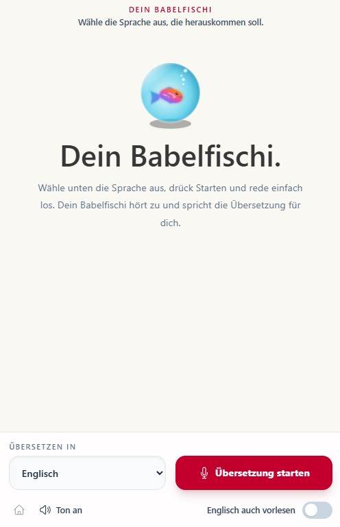

# Dein Babelfischi



Dein Babelfischi ist eine Echtzeit-Uebersetzungs-App fuer gesprochene Sprache. Die App hoert ueber das Mikrofon zu, erkennt die Eingangssprache automatisch und spricht die Uebersetzung in einer ausgewaehlten Zielsprache zurueck.

Gebaut mit React, Vite, Node und dem Google Gen AI SDK. Die Uebersetzung laeuft ueber Gemini 3.5 Live Translate.

## Was die App macht

- Du waehlst nur die Zielsprache aus.
- Gemini erkennt die gesprochene Eingangssprache automatisch.
- `Englisch auch vorlesen` steuert, ob Sprache in der Zielsprache ebenfalls wiederholt wird.
- Der Gemini API Key bleibt im lokalen Node-Backend.
- Der Browser bekommt nur kurzlebige Live API Tokens.

## Wichtige Auth-Realitaet

Diese App nutzt Gemini Live API Ephemeral Tokens, damit der Browser direkt mit Live Translate sprechen kann, ohne den langlebigen API Key offenzulegen.

Dafuer brauchst du aktuell einen Gemini API Key aus Google AI Studio. Google Cloud ADC, Service-Account-Keys und Gemini Enterprise Agent Platform Auth funktionieren fuer diesen Token-Flow nicht.

Kurz gesagt:

```env
GEMINI_API_KEY=dein_ai_studio_key
```

Nicht verwenden:

```env
GOOGLE_CLOUD_PROJECT=
GOOGLE_GENAI_USE_ENTERPRISE=True
```

Diese Cloud-Variablen sind fuer andere Gemini Enterprise API Calls sinnvoll, aber nicht fuer den `client.authTokens.create()` Flow dieser App.

## Voraussetzungen

- Node.js 20 oder neuer
- npm
- Ein Gemini API Key aus Google AI Studio
- Ein Browser mit Mikrofonzugriff

## Schnellstart

1. Abhaengigkeiten installieren:

```bash
npm install
```

2. Lokale Environment-Datei erstellen:

```bash
cp .env.example .env
```

Unter Windows PowerShell:

```powershell
Copy-Item .env.example .env
```

3. `.env` oeffnen und den AI Studio Key eintragen:

```env
GEMINI_API_KEY=dein_ai_studio_key
GEMINI_LIVE_TRANSLATE_MODEL=gemini-3.5-live-translate-preview
```

4. App starten:

```bash
npm run dev
```

5. App oeffnen:

[http://localhost:3000](http://localhost:3000)

Der lokale Token-Server laeuft hier:

[http://localhost:8787/api/health](http://localhost:8787/api/health)

## Environment und Secrets

`.env` ist in Git ignoriert und darf nicht committed werden.

`.env.example` ist die sichere Vorlage fuer Open Source:

```env
GEMINI_API_KEY=
GEMINI_LIVE_TRANSLATE_MODEL=gemini-3.5-live-translate-preview
```

Der API Key gehoert nur in `.env`, nie in den README, nie in Screenshots, nie in committed Code.

## Scripts

```bash
npm run dev
```

Startet Backend und Vite-Frontend zusammen.

```bash
npm run server
```

Startet nur den lokalen Token-Server.

```bash
npm run dev:vite
```

Startet nur das Vite-Frontend.

```bash
npm run build
```

Erstellt den Production Build.

## Wie es funktioniert

1. Das Frontend fragt beim lokalen Backend ein kurzlebiges Live API Token an.
2. Das Backend erstellt das Token mit `@google/genai`.
3. Das Frontend oeffnet damit eine Gemini Live API Session mit `gemini-3.5-live-translate-preview`.
4. Mikrofon-Audio wird als rohes 16 kHz PCM gestreamt.
5. Gemini streamt uebersetztes 24 kHz PCM Audio plus Transkripte zurueck.
6. Die App spielt die Uebersetzung ab und speichert den Verlauf zum erneuten Anhoeren.

## Projektstruktur

```text
.
|-- App.tsx
|-- assets/
|   `-- babelfischi.jpg
|-- components/
|   |-- BottomControls.tsx
|   `-- ConversationBubble.tsx
|-- hooks/
|   `-- useLiveMicrophone.ts
|-- services/
|   `-- liveTranslateService.ts
|-- utils/
|   `-- pcmAudioQueue.ts
|-- server.mjs
|-- scripts/
|   `-- dev.mjs
|-- types.ts
`-- vite.config.ts
```

## Troubleshooting

Wenn die Token-Erstellung fehlschlaegt, pruefe `.env` und starte `npm run dev` neu.

Wenn du Google Cloud Auth versucht hast, wechsle zurueck zu einem Gemini API Key aus AI Studio. Der Backend-Endpunkt nutzt `client.authTokens.create()`, und diese Methode unterstuetzt hier nur den Gemini Developer API Token-Flow.

Wenn das Mikrofon nicht funktioniert, erlaube den Mikrofonzugriff im Browser.

Wenn Port `3000` oder `8787` belegt ist, stoppe den alten Prozess und starte `npm run dev` erneut.
